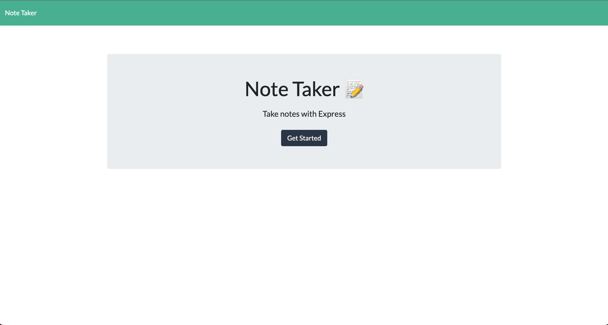
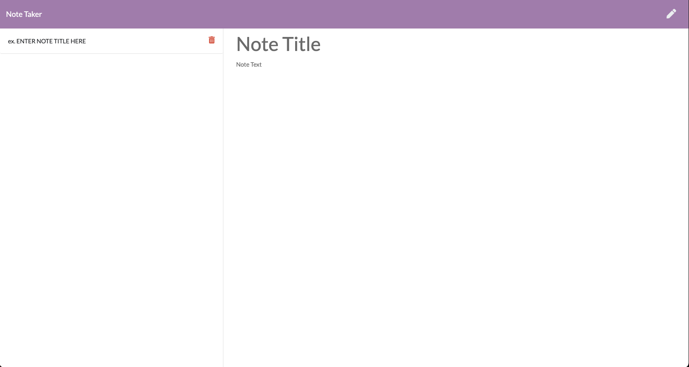
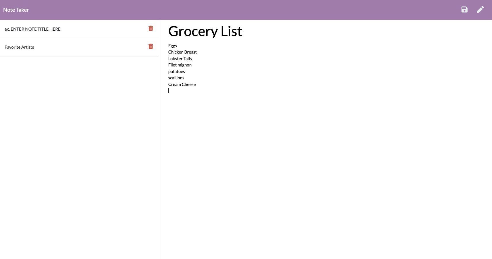

# Note Taker Starter Code

 ## User Story
AS A small business owner
I WANT to be able to write and save notes
SO THAT I can organize my thoughts and keep track of tasks I need to complete

## Desription
This app allows the user to create note with a title for each one of them to be saved. The saved notes will appear on the left hand side and if clicked displayed in the main note section. 
This app made use of Node.js, Express.js and javascript to create the front and backend of the application. It has been deployed using [Heroku](https://vast-brook-03956.herokuapp.com/) .

## Table of Contents
* [Installation](#installation)
* [Usage](#usage)
* [Contributing Guidelines](#contributing)
* [License](#license)

## Installation
 
 To run the app from your local machine, you must download all files and initial;ize the PORT from within the app folder using 'npm start' in the command line. Once PORT has been initialized, app can be opened in browser by navigating to 'localhost:3001'. 
 For an easier method of accessing the app, use the heroku link.

## Usage 

On opening the app, the user will be presented with a landing page with a button to 'get started'. On clicking the button, the user will be taken to the notes app where user can enter a note with a title and save it. Saved notes will be displayed in the left-hand sidebar and on clicking a note in the sidebar, it will be displayed in the main notes section. Clicking the pencil icon in the tp right hand corner will clear all input fields so new notes can be entered. If a note in no longer needed, it can be deleted using the delete icon next to each note in the sidebar.

 
## License
None 

 ## Acceptance Criteria 
* GIVEN a note-taking application
* WHEN I open the Note Taker
* THEN I am presented with a landing page with a link to a notes page
* WHEN I click on the link to the notes page
* THEN I am presented with a page with existing notes listed in the left-hand column, plus empty fields to enter a new note title and the note’s text in the right-hand column
* WHEN I enter a new note title and the note’s text
* THEN a Save icon appears in the navigation at the top of the page
* WHEN I click on the Save icon
* THEN the new note I have entered is saved and appears in the left-hand column with the other existing notes
* WHEN I click on an existing note in the list in the left-hand column
* THEN that note appears in the right-hand column
* WHEN I click on the Write icon in the navigation at the top of the page
* THEN I am presented with empty fields to enter a new note title and the note’s text in the right-hand column

## Contact
[Nestor Montañez on Github](https://github.com/Nuno0123)